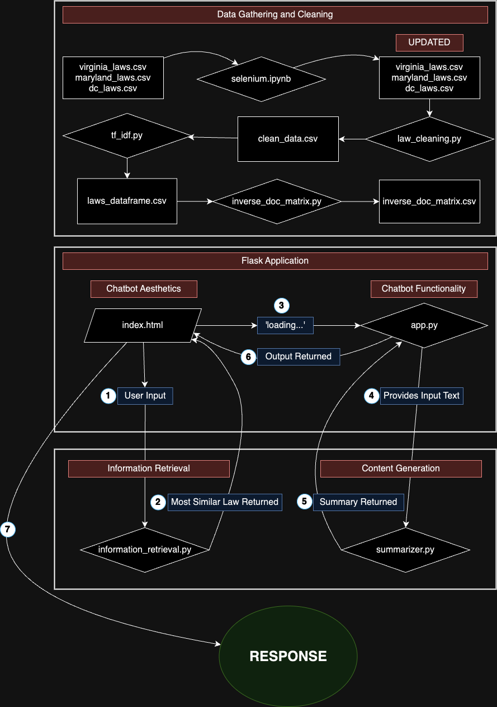

# 5400 Final Project

# LeTeRS: The Legal Tenants' Rights Summarizer Application

## Sonali Dabhi, Tereza Martinkova, Katherine Mead, Natalie Smith

### Project Goals

Overall, the aim of this project is to empower renters in the D.C., Maryland, and Virginia areas with legal knowledge of their rights as tenants through an application that allows users to pose an apartment issue they are facing to a chatbot, which will then retrieve the law that best fits the issue and summarize it for the user in an easily understandable way such that it can be understood and referenced to push landlords, property managers, or property management companies to quickly resolve issues they are legally obligated to take care of.

The driving concept of the application is retrieval augmented generation, or RAG, which is made up of two phases:

1.  Information Retrieval: In this phase, the package retrieves relevant information based on the user's prompt. For the purposes of the LeTeRS application, the user feeding a response to the chatbot prompts the application to filter the dataset of laws and then search for and retrieve the law in the dataset that best matches the user's prompt. For example, if the user tells the chatbot that they are living in Virginia and are experiencing issues with mold, the application will retrieve the law in Virginia that most closely deals with issues relating to mold. Once this law is retrieved, it is passed on to phase two of the RAG process.

2.  Content Generation: Augmented with the information retrieved in phase one, this phase of RAG generates content through a response to the user. In the case of LeTeRS, the content generation phase is the summarizer, wherein the retrieved law from phase one is passed to the LLM summarizer (Google Pegasus, for our purposes). The chatbot then responds to the user with the title and summary of the law that best fits the user's original prompt.

### How to use LeTeRS and its key features

#### Data Gathering and Cleaning:

The files that make up the data gathering and cleaning portion of the application are listed below, and should be run in the order they are listed.

- selenium.ipynb: this file gathers and cleans the D.C., Maryland, and Virginia law csv data using the python package [Selenium.](https://selenium-python.readthedocs.io/)
- law_cleaning.py: this file takes the cleaned data and subsets the laws by state, splitting up law text and law title. This file makes use of logging to confirm the data is finished cleaning.
- tf_idf.py: using TfidfVectorizer, this file creates keywords for each law through the use of TF-IDF across the collection of laws.

### Flask

The Flask portion of the project consists of two main files: app.py, and index.html, and two files that support the precise function of the application: information_retrieval.py and summarizer.py. The index.html part of Flask creates the aesthetics of the chatbot and supports it's functionality, such has what multiple choice buttons are offered, and how is the user input used to generate the desired output. The starter code has been adapted from https://medium.com/@mailsushmita.m/create-an-generative-ai-chatbot-using-python-and-flask-a-step-by-step-guide-ea39439cf9ed and has been heavily adjusted to create the final product. The index.html file can be divided into two parts: the aesthetic side of chatbot and it's functionality. The aesthetic part in our code is everything before script and the script part is what navigates the chatbot's functionality. In the script part of the html file are four main functions: showFirstQuestion(), handleChoice(), handleUserInput(), and summarizeText(), where the last one has an error handling function within, and relies on the other three files: app.py, information_retrieval.py, and summarizer.py. The first three functions are standalone functions.

#### index.html

Everything in the script part of the html file is written in Java, as that is the appropriate language to choose when creating a chatbot. Before doing anything else, we start by setting our conversation point to 'askLocation'. We will see several conversation points through out the code, and these, as their name suggests, simply explain what part of the conversation with the chatbot the user us for us to better understand. After that, we also want to initialize input1 and input2, as we are going to use these for information retrieval later on in the project. From there we can move on to our first function - showFirstQuestion, which is self-explanatory, as it does exactly as the name suggests and asks the user "What state are you located in?", which is followed by giving the user a multiple choice option for VA, MD, and DC, as there are the only states we gathered laws for and the use of multiple choice allows us the decrease the chance of error in inputting the state name. The first step we see here is printing the question for the user to see, which is the end of using the showFirstQuestion function.

From here we move to the second function handleChoice(). The input of this second function is whatever the user chooses in the multiple choice to be their state selection. In handleChoice(), we assign the state selection to the variable called input1, which is later used in the last function that is connected to the other three python files to filter the data set for the selected state's laws only. Based on the choice the user makes here, the chatbot also prints the choice, which is mainly just for good practice. The initiates the a new conversation point 'askIssue'. This again simply means the chatbot will print the question "What issue can I assist you with?", which concludes the use of handleChoice() function.

This third function handleUserInput() firstly creates a variable called rawText, which represents the text of the user input in a string format, and prints it in the chatbot. From here the chatbot offers two options, the first one being if the conversation point is at 'askIssue', it assigns rawText to our variable input2, and with input1 and input2 in memory it moves to the summarizeText function. This means that the text processing has began and the chatbot prints 'loading...' statement to let the user know it is not stuck, just processing. The next step is calling the function process_input, which is located in the app.py file, and needs input1 and input2 to run, which is provided by the summarizeText() function in our html file. Once all text processing has been complete, the 'loading...' statement disappears and title law and the summary of the law, generated by app.py using information_retrieval.py and summarizer.py are printed in the chatbot. Consequently, the conversation point changes to 'restartPrompt', which is our second option in the handleUserInput() function. When the conversation point is at 'restartPrompt', the chatbot offers the user a choice between 'yes' and 'no' and asks prints a question in the chatbot 'Do you want to begin again? (yes/no)', if the user selects 'yes' the prompt restarts and conversation point becomes 'askLocation' again. However, if the user chooses 'no' the chatbot prints a goodbye message and the conversation doesn't continue. To restart the conversation the user can either simply type 'yes' again or refresh the page. As mentioned in the beginning, the last part of the html file is error handling, which is simply printing an error message in response to user input2.

#### app.py

Once we reach the summarizeText() function in in the html file, we move to the app.py file. The first thing after importing all the packages we notice are the following two commands:

\*from chatbot.functions.informationretrieval import \*\*

\*from chatbot.functions.summarizer import \*\*

This means that the functions build in information_retrieval.py and summarizer.py are imported and ready to use in app.py. The first function in the app.py 'home' simply defines the path to the homepage that is going to render, and the second function get_bot_response defines path to the model from where we get the original text and defines the response as the output of summarize function when userText (also known as input2) is the input. Next we have the get_summary function, which also has a decorator that assigns the function an alternative name '/summarize', which means that when we would see this in the html file, it would be calling this get_summary function. This get_summary function is a simple try and except statement, where it tries to get the input2 text and use the summarize function from the summarizer.py (which will be described later) to print its output. If that is not possible, it raises an error and doesn't proceed.

The last function in the app.py is the process_input function, which we might remember as part of the html file summarizeText() function. Here, we have another try and except statement, where in the try statement we assign input1 and input2 to variables, and go through several steps to return the text summary. The first is the clean_text function form information_retrieval.py file, that takes in input2. Next we are creating an index using the find_most_similar_law function, also from the information_retrieval.py file, which takes in input1, and the cleaned text returned by the clean_text function. Finally, we are extracting the law text and law title using the get_law function, yet again from the information_retrieval.py file, which intakes the index returned by the find_most_similar_law function, which is subsequently inputted into the summarize function from the summarizer.py file, which returns the summary of the correctly identified, and retrieved text. The final output of the function is then returning the law title and the summary of the law text. If this try statement fails, the function goes to the except statement, which raises an error.

#### Information Retrieval

The files that make up the information retrieval portion of the application are listed below (in order):

1. clean_text: this function takes in the user's input and cleans it by removing punctuation, making all letters lowercase, removing stop words, and lemmatizing the text. Importantly, this is the same function that is used to clean all of the laws in the database.
2. find_most_similar_law: this function takes in the user's input and the cleaned text and returns the index of the most similar law to the user's input. The user input is compared to the laws in the database using cosine similarity, and the index of the law with the highest cosine similarity is returned.

$$\text { similarity }=\cos (\theta)=\frac{\mathbf{A} \cdot \mathbf{B}}{\|\mathbf{A}\|\|\mathbf{B}\|}=\frac{\sum_{i=1}^n A_i B_i}{\sqrt{\sum_{i=1}^n A_i^2} \sqrt{\sum_{i=1}^n B_i^2}}$$

3. get_law: this function takes in the index of the most similar law and returns the law text and law title.

This component of the project is tested in the test_information_retrieval.py file. 

#### Content Summarization

The summarizer.py file contains two functions, summarize_initialize() and summarize(). The first function, as suggested by the name initializes the summarizer by defining the model_name variable as the Google Pegasus Summarizer, which means we are using are pre-trained summarizer developed by Google. To be able to summarize text, we need to define three more variables - the tokenizer, device and model, which is also what is returned by this function. The tokenizer we are using is part of the Google Pegasus package, so it just needs to be called. The device is defined by a if-else statement, where we try to make the summarizer run on CUDA (Compute Unified Device Architecture), which allows for parallel computing. If CUDA is not available on our device, the else statement actives CPU (Central Processing Unit) as the processor for this task. Finally, our model is called PegasusForConditionalGeneration, again from the Google Pegasus package, using the device selected in the if-else statement.

The summarize function takes in the input_text, which is being produced as part of the app.py file. Inside our summarize function, we use the previous summarize_initialize() function to define the tokenizer, model and device we are going to be using. First, we define input_text, and produce tokenized_text function, using the tokenizer defined earlier, taking in the input_text just created. Withing the tokenizer function, we also state that we want to output to be in a pytorch format with a maximum length of 512, truncated. The output generated it then put in the model, stating that the minimum length of the summary should be 30 characters and the maximum length 300 characters. Finally, we can use the tokenizer again to decode our pytorch format and produce a string, skipping special tokens, which is what to final output of this function will be. A string without any special tokens. This output is then used in app.py processing_input() function, and being forwarded to the index.html, which prints it in the chatbot as a response to input2.

#### Using the application

**Steps To Initiate Environment**

- pip install virtualenv
- virtualenv chatbot_env
- source chatbot_env/bin/activate
- cd chatbot/chatbot
- pip install -r requirements.txt
- cd ../ **Main Command: python -m chatbot.bin.main**

#### LeTeRS code flowchart

